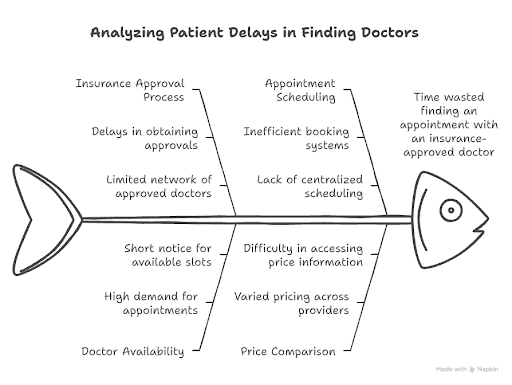

# Tempus Cura ("Time of Care")
Eight million patients are waiting for NHS treatment or therapy, and the waiting list is not coming down. So people are turning to private healthcare. Last year, demand for private healthcare grew by 18% - the market is worth an estimated £7.6 billion, of which £6.15 billion came from insured patients. However, the private healthcare system has capacity contraints on both the demand side (patient) and supply side (availability of Doctors). 

The problem is accessing affordable care. This project's ultimate goal is two-fold:
1. Help patients find and book an insurance-approved doctor and, for self-funded patients, get the best price. 
2. Reduce unnecessary administration delays in invoicing and payments for doctors and de-incentivising preference for booking self-pay patients. 

## Table of contents
- [Problems in the Private Healthcare Process](#problems-in-the-private-healthcare-process)
- [Solution using Portia AI](#solution-using-portia-ai)
- [How we used the Portia agent framework](#how-we-used-the-portia-agent-framework)
- [Proof of Concept](#proof-of-concept)
- [Use of Portia AI](#use-of-portia-ai)
- [Technical Setup](#technical-setup)

## Problems in the Private Healthcare Process
### Appointment Booking
1. Patient first calls insurance company to get pre-authorisation code
    * PAIN POINT: Many patients only get this code later, after their first appointment (causing admin issues later)
2. Patient looks up potential doctors using potentially variety of methods (e.g. insurance company's search tool, google)
    * PAIN POINT: Doctor's not necessarily listed in an order preferable for patients, taking into account price and availability
3. Patient chooses doctor and contacts them to book appointment
    * PAIN POINT: Doctor's contact details can be incorrect, leading to unnecessary delays for patient
    * PAIN POINT: Patient may contact a doctor only to find out they are not covered by the patient's insurance company or not available when required
4. If doctor available, appointment booked with patient
5. Patient attends appointment

#### Visual Summary of Pain Points for Appointment Delays



### Invoicing
1. Doctor or administrator generates a custom PDF for the invoice (inc. patient details and pre-authorisation code)
    * PAIN POINT: Patient sometimes receive care without a pre-authorisation code from their insurance company
2. The doctor or administrator logs into Healthcode and uploads the invoice 
3. Healthcode staff verify invoice details
4. Healthcode receive approval/rejection decision from insurance company
    * PAIN POINT: Doctors must manually log in and check for rejections (e.g. due to missing post code) - can remain unnoticed by doctor, leading to delayed (or even no) payments, and also time wasted checking for invoice errors/rejections
    * PAIN POINT: Rejections are more likely when the pre-authorisation code is issued after the appointment date, leading to shortfalls for doctors ("delay, deny, defend")
5. Third-party billing companies follow up to ensure patient and insurance companies pay doctor
    * PAIN POINT: Sometimes details are missing from invoices (e.g. patient address), which slows down the process and if the process is  'delayed' beyond the arbituary 6-month deadline then the insurance company rejects the payment.  

Collecting time across the private healthcare industry is 28 to 90 days. So **private Doctors prefer booking self-pay patients** over insured patients. 

## Solution using Portia AI
Our goal in this project was to solve several of these specific pain points using Portia AI, especially its human-in-the-loop capabilities. Our exact goals were:
- Ensure patients are only shown doctors approved by their insurance company
- Speed up appointment booking process, giving patients a single platform to efficiently find a suitable doctor, taking into account location, specialty, and price, and ordering in an intelligent way
- Help doctors by reducing shortfall from insurers and being paid more quickly

## How we used the Portia agent framework
### Appointment Booking
1. Patient goes to the Tempus Cura platform
2. Patient enters postcode, insurance company (unless self-paying), specialty, and procedure and clicks "Search Doctors"
3. If the patient is insured, the Portia agent could use the ZendDesk plugin to call the associated insurance company's call centre to verify the terms of the insurance policy to get a pre-authorisation code
3. The Portia agent uses a generic doctor search tool on the PHIN website (portal for private healthcare information and doctors) (using browser tool) or a specific insurance company's doctor finder and returns a list of nearby and available doctors who the patient's insurance company approves
4. Patient chooses preferred doctor and appointment day/time (potential use of Google Workspace for accessing doctors' calendars)
5. Portia agent prompts doctor to approve appointment request
6. The doctor approves or rejects the appointment request (human-in-the-loop)
7. Patient notified of appointment request outcome

### Invoicing
1. The doctor logs into the Tempus Cura platform to enter invoice data
2. System generates invoice PDF
3. Portia agent accesses Healthcode website
4. If necessary, the doctor authenticates with Healthcode (human-in-the-loop)
5. Portia agent uploads invoice PDF within Healthcode
6. Healthcode staff verify invoice details (human-in-the-loop)
7. Healthcode receive approval/rejection decision from insurance company
8. Portia Agent monitors for decision
    - approvals - notifies doctor administrator
    - rejections ("failed payments") - notifies doctor administrator

## Proof-Of-Concept
Our current proof-of-concept does not achieve all the above proposed processes. It currently supports self-paying patients and utilises the generic PHIN platform to search for suitable doctors to get patients the nearest, best-priced, and earliest available appointment.

## Use of Portia AI
In our proof-of-concept application, Portia AI is used in the appointment booking process to gather relevant doctors for a given patient using the PHIN platform, which then hands off to the patient user to decide which to book (potentially automate contact process with doctors using Portia AI, but initially providing a more relevant list of doctors to patients to which they could manually call).

Beyond the proof-of-concept, we envisage Portia AI's capabilities and human-in-the-loop capabilities being used extensively in both the appointment booking and invoicing processes, particularly the latter (for example, authentication with Healthcode by the doctor/administrator).

## Technical Setup
```sh
    python -m venv venv
    source venv/bin/activate  # On Windows use `.\venv\Scripts\Activate`
    pip install -r requirements.txt
    python main.py
```
